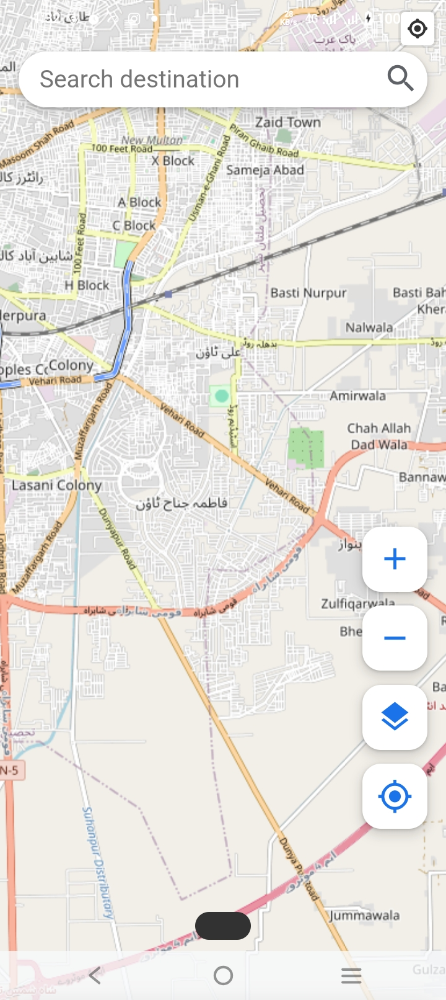

# Planora
Your Personal Travel Planner for Smart and Organized Trip Management.

---

## About the App

Planora is an Android-based travel planning application designed to help users organize trips, manage schedules, and simplify travel planning. The app provides a user-friendly interface for managing destinations, travel activities, and personalized planning features. It is suitable for travelers, students, tourists, and anyone who wants an organized travel experience. Planora solves the problem of manual travel planning by offering a digital and easy-to-use planning system.

---

## App Screenshots

Add screenshots inside the screenshots folder.

|  |  |  |  |  |

---

## Features

- User authentication
- Travel planning management
- Personalized travel schedules
- Destination organization
- Interactive user interface
- Firebase integration
- Real-time data handling
- Android mobile support

---

## Technologies Used

- Java
- Android Studio
- XML
- Firebase Authentication
- Firebase Database
- Gradle
- Android SDK

---

## APK Download

[Download APK](apk/planora.apk)

---

## How to Install the APK

1. Download the APK file.
2. Open the APK on an Android phone.
3. Allow installation from unknown sources if required.
4. Install and run the application.
5. Allow required permissions.

---

## How to Run the Project

1. Clone or download the project.
2. Open the project in Android Studio.
3. Sync Gradle files.
4. Connect Firebase services.
5. Run the app on an Android emulator or physical device.

---

## Privacy Policy

[View Privacy Policy](docs/privacy_policy.pdf)

---

## Future Enhancements

- AI-based travel recommendations
- Online hotel booking integration
- Expense tracking system
- Notification reminders
- Dark mode support
- Admin dashboard
- Cloud synchronization

---

## Developed By

Areesha Qamar  
BSITMA-23-75  
Department of Information Technology  
University of Layyah
---
